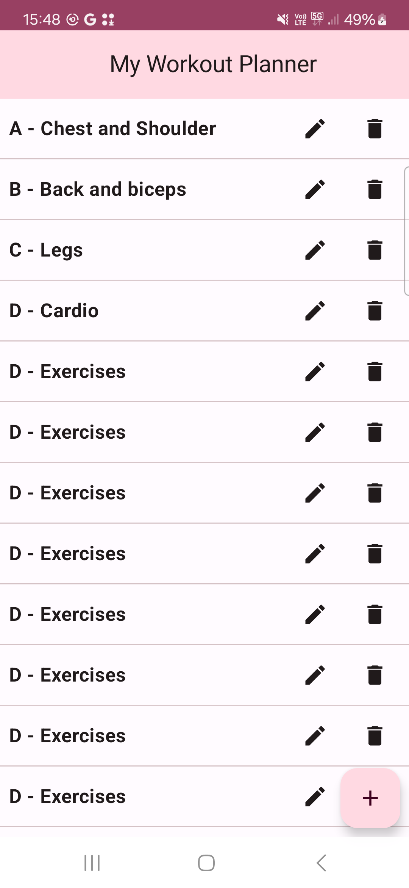
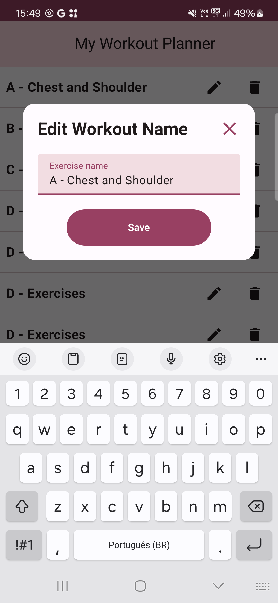
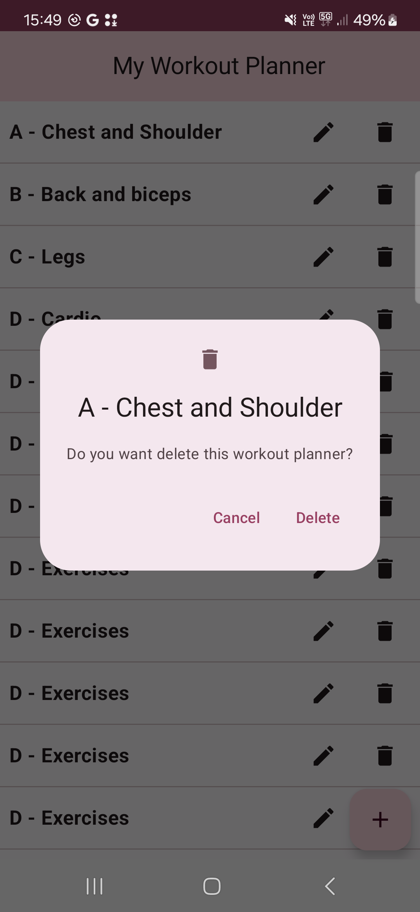
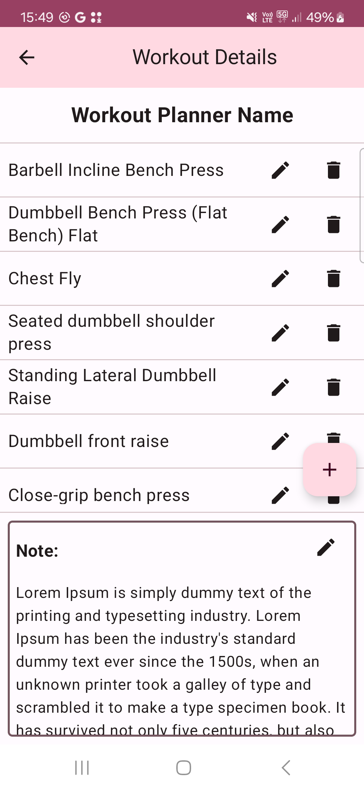

# MyWorkoutPlanner
## An Android App of Workout Planner showing how to use Room and Navigation in Compose

* Compose
* Compose Navigations
* Database with Room API
* Kotlin Flow API
* Hilt
* Version Catalogs dependencies (libs.versions.toml)

This project is a sample to show how to building an Android application with Compose. There 2 screens in compose and compose navigation beetwen them. A database
with 2 tables were implemented too with Flow API.

Note: A one-to-many releationship was implemented in the logic of application (ViewModel)

 

 

### References:
 * https://medium.com/@prakash.ayinala7/getting-started-with-room-database-in-kotlin-jetpack-compose-mvvm-dagger-hilt-3bdec10b70ed
 * https://saurabhjadhavblogs.com/compose-mvvm-roomdb-with-flow-and-di
 * https://developer.android.com/codelabs/basic-android-kotlin-compose-navigation#0
 * https://proandroiddev.com/jetpack-compose-screen-navigation-with-type-safety-337ec177026e